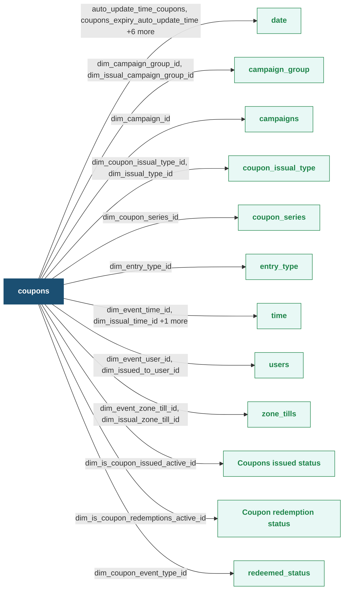

This table captures the event wherein coupons are issued to or redeemed by the customer. It captures the date and time of the coupon issual/ redemption, the associated bill amount, expiry date of the coupon, and the customer for which the coupon issual/ redemption has been done.

**Databricks Table Name:** coupons

**Coupons - Entity Relationship Diagram (ERD)**

Zoom in the table for more clarity. Click the table title to view its details

**Coupons Fact Table**

| **Column Name** | **Data Type** | **Description New** | Linked Table | **Availability for Export in theCoupons template** |
| :--- | :---: | :--- | :---: | :--- |
| auto_update_time_coupons | string | Date and time when the corresponding record in the coupons table available at the source was last updated. It is in the Unix timestamp format. | [date](https://docs.capillarytech.com/docs/dimension-tables#date) | Yes; Measure Name: Auto Update Time Coupons |
| bill_id | bigint | Identifier for the bill against which the coupons have been issued or redeemed. | _ | Yes; Measure Name: Bill Id |
| coupon_code | string | A unique identifier is generated for the coupons. | _ | Yes; Measure Name: Coupon Code |
| coupon_code_src | string | Represents the source coupon code. It is the same as the coupon code. | _ | Yes; Measure Name: Coupon Code Src |
| coupons_expiry_auto_update_time | bigint | Indicates the timestamp when the coupon's expiry information was last automatically updated by the system during a issual or transaction which issued the coupon. | [date](https://docs.capillarytech.com/docs/dimension-tables#date) | NA |
| dim_campaign_group_id | bigint | Identifier for the campaign group (test or control) for which the coupon has been issued or redeemed. | [campaign_group](https://docs.capillarytech.com/docs/dimension-tables#campaign-group) | Yes; Dimension Name: Campaign Group |
| dim_campaign_id | bigint | Identifier for the campaign for which the coupon has been issued or redeemed. | [campaigns](https://docs.capillarytech.com/docs/dimension-tables#campaigns) | Yes; Dimension Name: Campaign Id |
| dim_coupon_issual_type_id | bigint | Identifier of the type of coupon issued. Possible values are - Single, and Bulk. Single: A single coupon is issued in response to a specific event. Bulk: Multiple coupons are issued simultaneously. | coupon_issual_type [Link](https://docs.capillarytech.com/docs/dimension-tables#coupon-issual-type-coupon_issual_type) | Yes; Dimension Name: Coupon Issual Type |
| dim_coupon_series_id | bigint | Identifier of the coupon series against which the coupon has been issued or redeemed. | [coupon_series](https://docs.capillarytech.com/docs/dimension-tables#coupon-series-coupon_series) | Yes; Dimension Name: Coupon Series |
| dim_coupons_expiry_date_id | bigint | Indicates the date until which the coupon is valid to be redeemed. | [date](https://docs.capillarytech.com/docs/dimension-tables#date) | Yes; Dimension Name: coupons_expiry_date |
| dim_coupons_expiry_time_id | bigint | Indicates the specific time on the expiry date until which the coupon is valid to be redeemed. | [date](https://docs.capillarytech.com/docs/dimension-tables#date) | Yes; Dimension Name:coupons_expiry_time |
| dim_entry_type_id | bigint | Captures the entry type for the coupon, whether it is a manual entry or through Intouch. | [entry_type](https://docs.capillarytech.com/docs/dimension-tables#entry-type-entry_type) | Yes; Dimension Name: Entry Type |
| dim_event_date_id | bigint | Date when the coupon issual or redemption has occurred. | [date](https://docs.capillarytech.com/docs/dimension-tables#date) | Yes; Dimension Name: Date |
| dim_event_time_id | bigint | Time when the coupon issual or redeemed. | [time](https://docs.capillarytech.com/docs/dimension-tables#time) | Yes; Dimension Name: Time |
| dim_event_user_id | bigint | Identifier of the user, set internally by Capillary. | [users](https://docs.capillarytech.com/docs/dimension-tables#users-users) | Yes; Dimension Name: User Id |
| dim_event_zone_till_id | bigint | Identifier assigned to the point-of-sale (POS) terminal within a store, where the coupon was issued/redeemed. It distinguishes one checkout location from another within the same store. | [zone_tills](https://docs.capillarytech.com/docs/dimension-tables#zone-till) | Yes; Dimension Name: Store Hierarchy > Till Id |
| dim_expiry_date_id | bigint | Date when the coupon is set to expire. | [date](https://docs.capillarytech.com/docs/dimension-tables#date) | Yes; Dimension Name: Expiry Date |
| dim_is_coupon_issued_active_id | bigint | Indicates whether the issued coupon is currently active. | [Coupons issued status](https://docs.capillarytech.com/docs/dimension-tables#coupon-status-is_coupon_issued_active-1) | Yes; Dimension Name:is_coupon_issued_active |
| dim_is_coupon_redemptions_active_id | bigint | Indicates whether redemptions are currently enabled for this coupon. | [Coupon redemption status](https://docs.capillarytech.com/docs/dimension-tables#coupon-redemption-status-is_coupon_redemptions_active) | Yes; Dimension Name: is_coupon_redemptions_active |
| dim_issual_campaign_group_id | bigint | Identifier for the campaign group associated with the coupon issual. | [campaign_group](https://docs.capillarytech.com/docs/dimension-tables#campaign-group) | Yes; Dimension Name: Campaign Group |
| dim_issual_date_id | bigint | Date when the coupon has been issued. | [date](https://docs.capillarytech.com/docs/dimension-tables#date) | Yes; Dimension Name: Issual Date |
| dim_issual_time_id | bigint | Time when the coupon has been issued. | [time](https://docs.capillarytech.com/docs/dimension-tables#time) | Yes; Dimension Name: Issual Time |
| dim_issual_type_id | bigint | Captures the issual type. Possible values are store and customer. | coupon_issual_type [Link](https://docs.capillarytech.com/docs/dimension-tables#coupon-issual-type-coupon_issual_type) | Yes; Dimension Name: Issual Type |
| dim_issual_zone_till_id | int | Identifier assigned to the point-of-sale (POS) terminal within a store, where the coupon was issued. It distinguishes one checkout location from another within the same store. | [zone_tills](https://docs.capillarytech.com/docs/dimension-tables#zone-till) | Yes; Dimension Name: Issual Zone Till |
| dim_issued_to_user_id | bigint | Identifier of the customer to whom the coupon has been issued. | [users](https://docs.capillarytech.com/docs/dimension-tables#users-users) | Yes; Dimension Name: User Id |
| dim_latest_updated_date_id | bigint | Date when the data corresponding to this event/row is changed in the source table. | [date](https://docs.capillarytech.com/docs/dimension-tables#date) | Yes; Measure Name: Latest Updated Date |
| dim_latest_updated_time_id | bigint | Time when the data corresponding to this event/row is changed in the source table. | [time](https://docs.capillarytech.com/docs/dimension-tables#time) | Yes; Measure Name: Latest Updated Time |
| event_id | bigint | Unique identifier of the coupons issual/redemption event, It is the primary key of this table. | _ | Yes; Measure Name: Event Id |
| issual_coupon_id | bigint | Unique identifier assigned to the coupon which has been issued. | _ | Yes; Measure Name: Issual Coupon Id |
| redemption_bill_amount | double | Total transaction amount of the bill against which the coupon has been redeemed. | _ | Yes; Measure Name: Redemption Bill Amount |
| used_bill_number | string | Bill number used while redeeming the coupon. | _ | Yes; Measure Name: Used Bill Number |
| year | int | Year when the coupon was issued/redeemed. | _ | Yes; Dimension Name: Year |
| dim_coupon_event_type_id | bigint | Identifier for the coupons event type (issual, redemption). It is the primary key of this table. | [redeemed_status](https://docs.capillarytech.com/docs/dimension-tables#redeemed-status-redeemed_status) | Yes; Dimension Name: Coupon Event Type |

