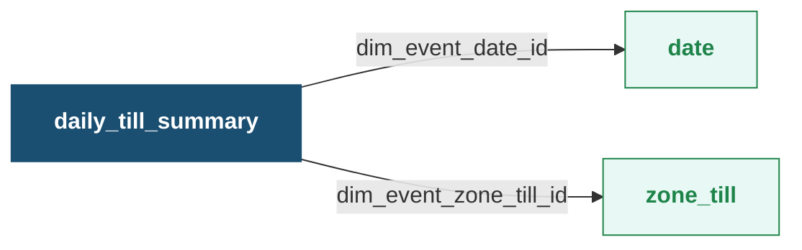

This facts table captures the daily transactions conducted at a specific point of sale (POS) terminal (till). It captures the information such as sales, points redeemed, returns, and loyalty  activities, allowing businesses to analyze POS-specific performance.

**Databricks Table Name:** daily\_till\_summary

**Daily Till Summary - Entity Relationship Diagram (ERD)**

Zoom in the table for more clarity. Click the table title to view its details.

**Daily Till Summary Fact Table**

| Column Name                               | Data Type | Description                                                                                                                                                                            | Linked Table                                                                 |
| ----------------------------------------- | --------- | -------------------------------------------------------------------------------------------------------------------------------------------------------------------------------------- | ---------------------------------------------------------------------------- |
| dim\_event\_date\_id                      | bigint    | Date of the transaction. It is the primary key of the table.                                                                                                                           | [date](https://docs.capillarytech.com/docs/dimension-tables#date)            |
| dim\_event\_zone\_till\_id                | bigint    | Identifier assigned to the point-of-sale (POS) terminal within a store. It distinguishes one checkout location from another within the same store. It is the primary key of the table. | [zone\_till](https://docs.capillarytech.com/docs/dimension-tables#zone-till) |
| not\_interested\_bill\_count              | bigint    | Number of bills generated from purchases of not-interested customers.                                                                                                                  | \_                                                                           |
| points\_redeemed                          | double    | Total points redeemed by the transactions made through the till (Point of sale counter).                                                                                               | \_                                                                           |
| total\_bills                              | bigint    | Total number of bills generated through the till.                                                                                                                                      | \_                                                                           |
| member\_returns                           | bigint    | Total count of returns from members.                                                                                                                                                   | \_                                                                           |
| points\_returned                          | double    | Total points reverted because of return transactions.                                                                                                                                  | \_                                                                           |
| total\_sales                              | double    | Total sales generated at the till including taxes and discounts.                                                                                                                       | \_                                                                           |
| non\_loyalty\_sales                       | double    | Sales generated from non-loyalty customers.                                                                                                                                            | \_                                                                           |
| non\_member\_returns                      | bigint    | Count of returns made by non-members.                                                                                                                                                  | \_                                                                           |
| extra\_sales                              | double    | The total sales amount generated from bills where points were redeemed at the till.                                                                                                    | \_                                                                           |
| number\_of\_non\_loyalty\_bills           | bigint    | Number of bills generated for non-loyalty customers.                                                                                                                                   | \_                                                                           |
| non\_loyalty\_sales\_from\_lineitem       | double    | Total sales from all the line items purchased by non-loyalty customers.                                                                                                                | \_                                                                           |
| number\_of\_loyal\_repeat\_customers      | bigint    | Total number of loyalty customers who have made more than one purchase.                                                                                                                | \_                                                                           |
| points\_redeemers                         | bigint    | Number of customers who redeemed points.                                                                                                                                               | \_                                                                           |
| test\_responder\_sales                    | double    | Sales generated from customers who responded to campaign messages (test group).                                                                                                        | \_                                                                           |
| loyalty\_sales                            | double    | Sales generated from transactions made by loyalty customers.                                                                                                                           | \_                                                                           |
| number\_of\_non\_loyal\_repeat\_customers | bigint    | Number of non-loyalty customers who made repeated transactions.                                                                                                                        | \_                                                                           |
| new\_non\_loyal\_transacted\_customers    | bigint    | Count of customers who are not part of any loyalty program and have made their initial purchases.                                                                                      | \_                                                                           |
| non\_member\_sales                        | double    | Sales generated from purchases done by non-loyalty members.                                                                                                                            | \_                                                                           |
| not\_interested\_sales                    | double    | Sales generated from not-interested customers.                                                                                                                                         | \_                                                                           |
| loyalty\_sales\_from\_lineitem            | double    | Total sales from all the line items purchased by loyalty customers.                                                                                                                    | \_                                                                           |
| coupons\_issued                           | bigint    | Total number of coupons issued through the till.                                                                                                                                       | \_                                                                           |
| coupons\_redeemed                         | bigint    | Total number of coupons redeemed through the till.                                                                                                                                     | \_                                                                           |
| points\_expired                           | double    | The total points that expired on a given date, which were originally awarded from the same till in the past.                                                                           | \_                                                                           |
| member\_sales                             | double    | Sales generated from loyalty customers.                                                                                                                                                | \_                                                                           |
| new\_loyal\_transacted\_customers         | bigint    | Count of customers who have newly enrolled in a loyalty program and have made their initial purchases.                                                                                 | \_                                                                           |
| number\_of\_loyalty\_bills                | bigint    | Number of bills generated by loyalty customers.                                                                                                                                        | \_                                                                           |
| points\_issued                            | double    | Total points issued through transactions made at the particular till.                                                                                                                  | \_                                                                           |
| year                                      | int       | Year of the transaction.                                                                                                                                                               | \_                                                                           |

